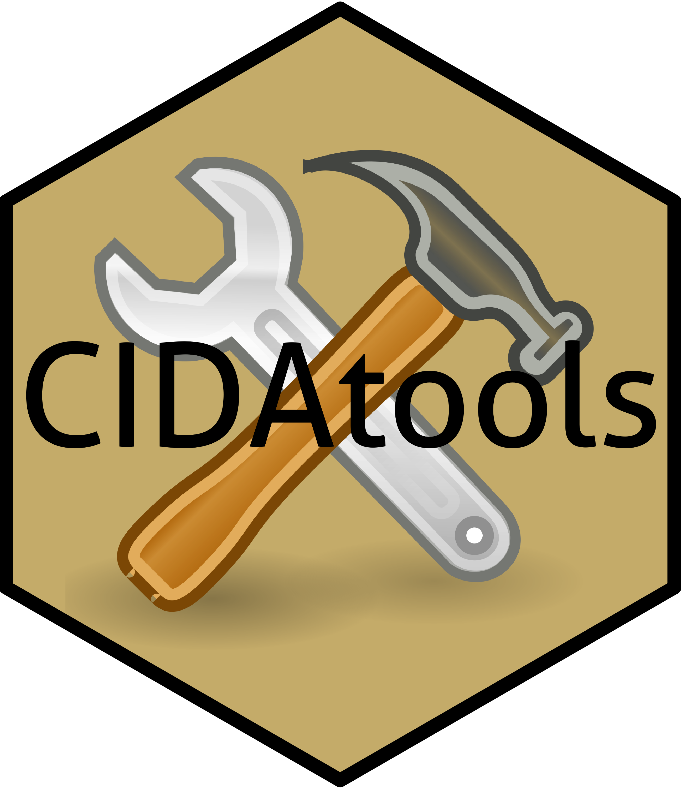

# CIDAtools



`devtools::install_github('ledbettc/CIDAtools')`

Example of header snippet using Project Data:
```
snippet header
	###########################################
	# Project: `r CIDAtools::ProjectName()`
	# Author: `r CIDAtools::ProjectAnalyst()`
	# Date: `r paste(format(Sys.Date(), '%m/%d/%Y'))`
	# #########################################
```
This package contains numerous templates and tools to make life at CIDA (part 
of the Colorado School of Public Health) happier and more efficient!

There is a CIDA project template (requires RStudio version 1.1) that sets up the
project folder using the CIDA template with ReadMe files in each folder and an 
option to set up a git repository. You can also save project metadata. 

This package also contains functions for reading excel files with colour columns
and the Table1 function. 

Please feel free to file an issue request if you encounter errors or would like 
to request new features.  
