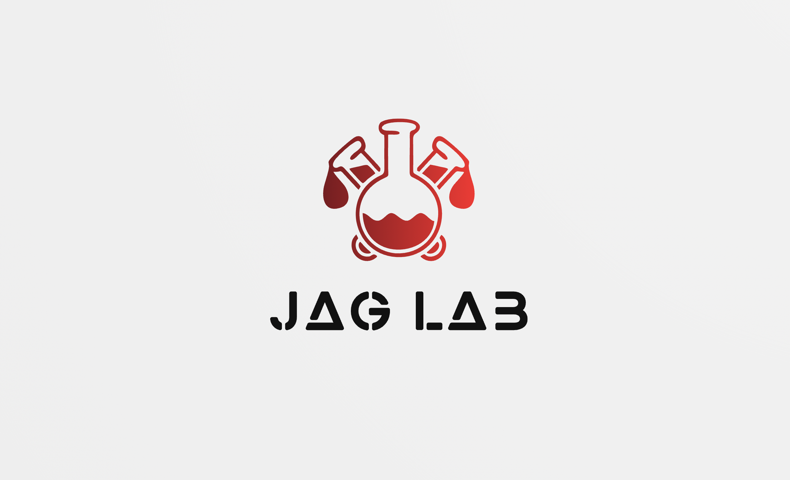

# JAG LAB Tools

<!--- These are examples. See https://shields.io for others or to customize this set of shields. You might want to include dependencies, project status and licence info here 
... did I reference the lab correctly here? -->


The primary purpose of this package is to <!--- primary purpose here -->. 



This package allows the Project Name, PI, and Project Analyst to be stored in a ProjData.dcf file to be 
easily retrieved and used in headers and reports. 

Example of header snippet using Project Data:
```
snippet header
	###########################################
	# Project: `r jagtools::ProjectName()`
	# Author: `r jagtools::ProjectAnalyst()`
	# Date: `r paste(format(Sys.Date(), '%m/%d/%Y'))`
	# #########################################
```

This package contains numerous templates and tools to make life at The Jagannathan Lab happier and more efficient!

There is a JAG LAB Tools project template (requires RStudio version 1.1) that sets up the project folder using the JAG LAB Tools template with ReadMe files in each folder and an option to set up a git repository. You can also save project metadata.

This package also contains functions for reading excel files with colour columns and the Table1 function.

Please feel free to file an issue request if you encounter errors or would like to request new features.

## Prerequisites

Before you begin, ensure you have met the following requirements:
<!--- These are just example requirements. Add, duplicate or remove as required
... what requirements do we need?--->
* You have installed the latest version of `<coding_language/dependency/requirement_1>`
* You have a `<Windows/Linux/Mac>` machine. State which OS is supported/which is not.
* You have read `<guide/link/documentation_related_to_project>`.

## Installing <project_name>

To install <project_name>, follow these steps:

Linux and macOS:
```
<install_command>
```

Windows:
```
<install_command>
```
## Using <project_name>

To use <project_name>, follow these steps:

```
<usage_example>
```

Add run commands and examples you think users will find useful. Provide an options reference for bonus points!

## Contributing to <project_name>
<!--- If your README is long or you have some specific process or steps you want contributors to follow, consider creating a separate CONTRIBUTING.md file--->
To contribute to <project_name>, follow these steps:

1. Fork this repository.
2. Create a branch: `git checkout -b <branch_name>`.
3. Make your changes and commit them: `git commit -m '<commit_message>'`
4. Push to the original branch: `git push origin <project_name>/<location>`
5. Create the pull request.

Alternatively see the GitHub documentation on [creating a pull request](https://help.github.com/en/github/collaborating-with-issues-and-pull-requests/creating-a-pull-request).

## Contributors

Thanks to the following people who have contributed to this project:

<!-- people to thank here -->

You might want to consider using something like the [All Contributors](https://github.com/all-contributors/all-contributors) specification and its [emoji key](https://allcontributors.org/docs/en/emoji-key).

## Contact

If you want to contact me you can reach me at adamsk@stanford.edu.

## License
<!--- If you're not sure which open license to use see https://choosealicense.com/--->

This project uses the following license: [<license_name>](<link>). <!-- does ours have a license? -->
